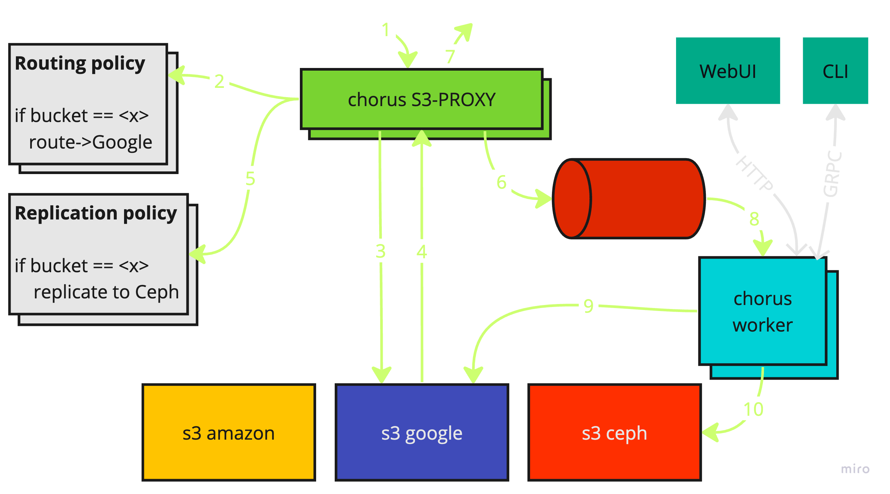

[](https://github.com/clyso/chorus/actions/workflows/ci-go.yml)

[](https://pkg.go.dev/github.com/clyso/chorus?tab=doc)
[](https://goreportcard.com/report/github.com/clyso/chorus)

# Chorus


Chorus is distributed vendor-agnostic S3-compatible backup, migration, and routing software. 
Once configured it can:
 - utilize multiple machines to speed up data transfer between S3 storages
 - checkpoint data transfer progress and resume it in case of failure
 - sync existing buckets and objects from source S3 to destination S3 along with metadata like ACLs
 - capture live bucket/object changes from source S3 and propagate them to destination S3
 - route S3 requests to different S3 storages based on the user's configuration
 - reduce downtime up to zero for switching to different S3 provider

Listed features can be configured per S3 user and per bucket with [management CLI](./tools/chorctl), [REST](https://petstore.swagger.io/?url=https://raw.githubusercontent.com/clyso/chorus/refs/heads/main/proto/gen/openapi/chorus/chorus.swagger.json)/[gRPC](./proto/chorus/chorus.proto) API, or [WebUI](./ui/).

## Components
[Chorus S3 Proxy](./service/proxy) service responsible for routing S3 requests and capturing data change events. 
[Chorus Agent](./service/agent) can be used as an alternative solution for capturing events instead of Proxy.
[Chorus Worker](./service/worker) service does actual data replication with the help of [RClone](https://github.com/rclone/rclone). Worker also hosts management API so it is a central and the only required component to start with Chorus.
Communication between Proxy/Agent and Worker is done over work queue. 
[Asynq](https://github.com/hibiken/asynq) with [Redis](https://github.com/redis/redis) is used as a work queue.



For more details, see:
- [Proxy](./service/proxy)
- [Worker](./service/worker)
- [Agent](./service/agent)
- [Management CLI](./tools/chorctl)
- [Web UI](./ui)
- [Standalone](./service/standalone) - all-in-one binary. Local playground with zero dependencies.

## Documentation

Documentation available at [docs.clyso.com](https://docs.clyso.com/docs/products/chorus/overview).

## Quick start

To get **the best** understanding of how to deploy, configure and use Chorus, start with the [docker-compose](./docker-compose) example. It is a good way to start with Chorus for people who are familiar with Docker and S3. Along with README with step-by-step instructions, it contains examples of working configurations which can be used as a reference for your own setup.


If using containers is not an option, try to run [standalone](./service/standalone) binary. It runs all docker-compose services in a single binary. So it is also possible to follow steps from docker-compose README but without Docker.

## Installation

To build and run Chorus component from source [install Go language](https://go.dev/doc/install) and use the following commands:
```shell
# clone the repository
git clone https://github.com/clyso/chorus.git && cd chorus

# run chorus worker
go run ./cmd/worker

# build chorus worker binary
go build ./cmd/worker
# run chorus worker binary
./worker

# run chorus worker with a custom YAML config file
go run ./cmd/worker -config <path to worker yaml config>

# run chorus proxy with a custom YAML config file
go run ./cmd/proxy -config <path to proxy yaml config>

# run chorus agent with a custom YAML config file
go run ./cmd/agent -config <path to agent yaml config>
```

Alternatively, all binaries can be with `go install`:
- [install Go language](https://go.dev/doc/install)
- make sure that `$GOPATH/bin` is in your `$PATH`: `export PATH=$PATH:$GOPATH/bin`
- use following commands to install and run binaries:
    ```shell
    # install chorus worker
    go install github.com/clyso/chorus/cmd/worker@latest

    # run chorus worker
    worker

    # run chorus worker with a custom YAML config file
    worker -config <path to worker yaml config>

    # install other binaries
    go install github.com/clyso/chorus/cmd/proxy@latest
    go install github.com/clyso/chorus/cmd/agent@latest
    go install github.com/clyso/chorus/cmd/chorus@latest
    ```

Component binaries for Linux, Windows, and MacOS are also published to the [GitHub releases](https://github.com/clyso/chorus/releases) page.

Additionally, Multi-platform Docker images are built from [Dockerfile](./Dockerfile), published to the OCI registry, and tagged with release version and `latest`:
- `harbor.clyso.com/chorus/proxy`
- `harbor.clyso.com/chorus/worker`
- `harbor.clyso.com/chorus/agent`
- `harbor.clyso.com/chorus/web-ui`UI is built from [ui/Dockerfile](./ui/Dockerfile)


Each Chorus component binary is published binaries for Linux, Windows, and MacOS to the [GitHub releases]
For deployment please refer to the documentation. Currently supported deployment methods:
- [docker-compose](./docker-compose) - local deployment with Docker compose. A good way to start with Chorus for peo
- Deploy the Chorus to K8s with Helm chart from the OCI registry:
    ```shell
    helm install <release name> oci://harbor.clyso.com/chorus/chorus
    ```
    See: [deploy/chorus](./deploy/chorus)


### From source
**REQUIREMENTS:**
- Go <https://go.dev/doc/install>

Run all-in-one [standalone binry](./service/standalone) from Go:
```shell
go run ./cmd/chorus
```

Or run each service separately:

**REQUIREMENTS:**
- Go <https://go.dev/doc/install>
- Redis <https://github.com/redis/redis>

```shell
# run chorus worker
go run ./cmd/worker

# run chorus worker with a custom YAML config file
go run ./cmd/worker -config <path to worker yaml config>

# run chorus proxy with a custom YAML config file
go run ./cmd/proxy -config <path to proxy yaml config>

# run chorus agent with a custom YAML config file
go run ./cmd/agent -config <path to agent yaml config>
```


## Develop

Chorus is written in Go and Go is the only required dependency to build, run, and test the project.


### Test
[Test](./test) package contains e2e tests for replications between S3 storages.
It starts:
- 3 embedded [gofakes3](https://github.com/johannesboyne/gofakes3) S3 storages
- embedded Redis [miniredis](https://github.com/alicebob/miniredis)
- Chorus Worker and Proxy services

All listed tools are written in go so test can be run without external dependencies just by:
```shell
go test ./test/...
```

Tests emulate real-world scenarios like:
- replication of existing buckets and objects with metadata
- capturing and syncing live bucket/object changes during migration
- switching between S3 endpoints with and without downtime
- access S3 with Chorus Proxy
- data migration integrity check

### Add APIs
Chorus worker [implements gRPC server](./pkg/api/) defined in [proto/chorus/chorus.proto](./proto/chorus/chorus.proto). It also provides REST API which is automatically generated from the proto file with [grpc-gateway](https://github.com/grpc-ecosystem/grpc-gateway). GRPC<->REST mappings are defined in [proto/http.yaml](./proto/http.yaml).

Steps to add new API:
1. Add new service or endpoint definition to [proto/chorus/chorus.proto](./proto/chorus/chorus.proto)
2. Add corresponding mapping to [proto/http.yaml](./proto/http.yaml)
3. Run `./proto/gen_proto.sh` to generate go client, server, and openapi definitions to [proto/gen](./proto/gen) directory.
4. Implement new service or endpoint in [pkg/api](./pkg/api/)
5. Support new API in [chorctl](./tools/chorctl) and [WebUI](./ui) clients.
