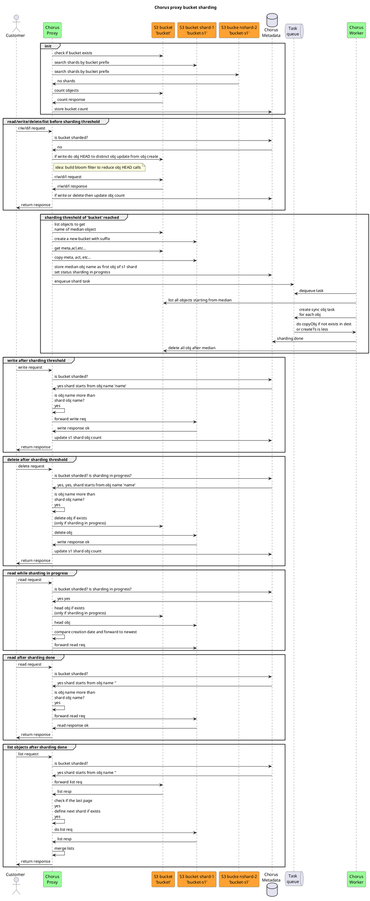
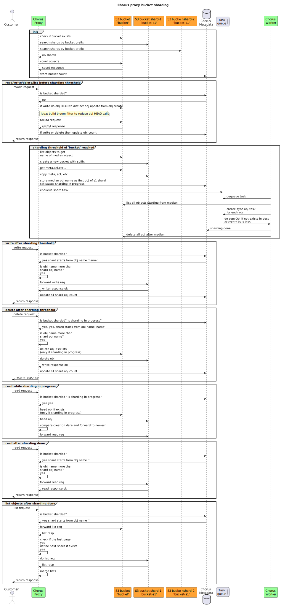

# Bucket Sharding Design Doc

## Background & Motivations

Having big amount of objects (> `10M`) in a single bucket may lead to performance issues in `ListObjects` method.
The solution is to split such bucket after some object count threshold into smaller buckets - aka sharding.

In this case Chorus proxy can maintain a single interface to a big bucket for all (`GET`,`LIST`,`PUT`,`DELETE`) methods
and place objects into smaller shards under the hood.

## Design Goals

### Correctness

Api should remain consistent, no eventual consistency.

**Motivation:** even with enabled sharding proxy s3 api should act exactly like direct s3 api call.

### No extra dependencies

No dependency on durable storage. This means that no state or metadata should be used for sharding implementation.
If it is not possible, then

- metadata should be stored in transient storage (local cache, redis, etc..)
- metadata could be lost and rebuild from buckets state.

**Motivation:** durable storage dependency will heavily increase Chorus operations costs.

### No extra API calls

Or minimize number of extra api calls.

**Motivation:** extra api calls leads to extra costs and increase latency.
Chorus proxy should minimize overhead.

## Design overview

High level sharding workflow:

1. Proxy receives object read/write request.
2. Proxy defines shard based on object name.
3. Proxy routes request to the shard.
4. In case of write/del requests proxy update shard object count.
5. If object count is above configured threshold, then shard is split in a half.

The workflow gives high level picture, but it leaves some important questions, like:

- How to shard or how to derive shard name from object name to fulfill design goals?
- How and do we need to support dynamic resharding? Or we can reserve `N` shards for each bucket from the start.
- How to name bucket shards to avoid collisions?

### How to shard

First approach is [consistent hashing](https://en.wikipedia.org/wiki/Consistent_hashing).

| Pros                                                                         | Cons                                                                                                                                                                                                                     |
|------------------------------------------------------------------------------|--------------------------------------------------------------------------------------------------------------------------------------------------------------------------------------------------------------------------|
| Don't need to store metadata. Bucket shard name calculated from object name. | Objects in shard buckets will be unordered, so it will be hard to implement `ListObjects` method in proxy. Proxy will need to iterate over all shards simultaneously to return sorted objects in `ListObjects` response. |

Another option is to shard by object name.
This means each shard stores `StartFromObjName` and shards are stored in decreasing sorted order.
Therefore, to define obj shard we iterate over shards and check if `ObjName > StartFromObjName`.

| Pros                                                                                                                            | Cons                                                                                                                                                                                                  |
|---------------------------------------------------------------------------------------------------------------------------------|-------------------------------------------------------------------------------------------------------------------------------------------------------------------------------------------------------|
| Objects are sorted. So Proxy can implement `ListObjecs` method by iterating over shards and calling `ListObjecs` on each shard. | Need to store shard metadata `StartFromObjName`. However it can be encoded into shard bucket name as suffix or can be obtained bu calling `ListObjecs` method for shard and getting the first object. |

**Conclusion:** Shard by name, because it will be hard to scale `ListObjecs` method with big amount of shards.

### Static or Dynamic

In static sharding, shards are created beforehand and not changed. In dynamic, bucket is sharded on the fly after
reaching object count threshold.

Static sharding is easier to implement because there is no need to support re-sharding logic.
Re-sharding logic increase api calls, and it is another place to make bugs.

On the other hand, it is not clear how to pick right number of shards for static sharding and how to balance shards in
situations where all writes goes to the same shard.

So static sharding approach is not feasible and dynamic should be implemented.

### Shards naming

`StartFromObjName` should be used as shard bucket suffix name. It will allow to sort shards in correct order by its name
and reduce needs in metadata storage.

Caveats:

- what if `bucket-name + obj name` is too long for shard bucket name?
  The bucket name can be between 3 and 63 characters and Object key names may be up to 1024 characters long.

Solutions:

- Trim bucket name and store `StartFromObjName` in metadata storage?
- Hash bucket name and store `StartFromObjName` in metadata storage?
- Just use numbers for bucket shard suffix and store `StartFromObjName` in metadata storage?

### Sequence diagram

  
Show PlantUML diagram source

