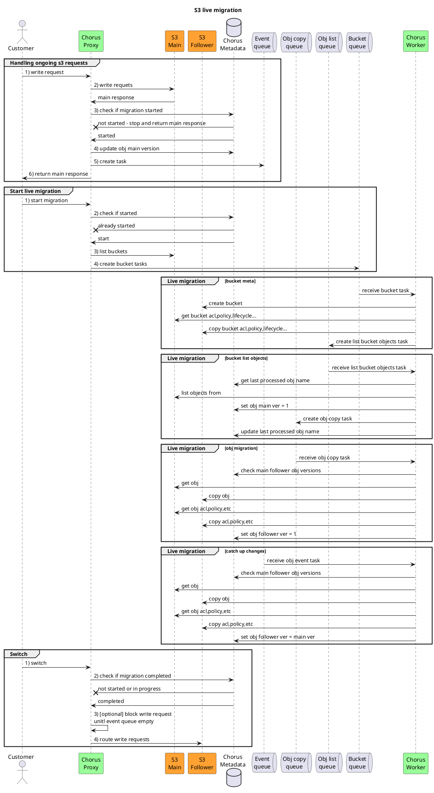
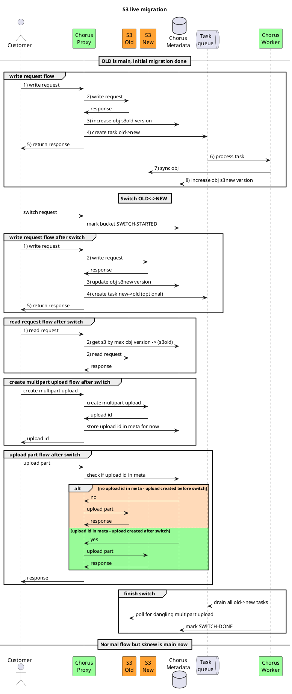

# Chorus s3 live migration

[Edit link](https://www.planttext.com/?text=tLPDRzim3BtxLn3fAK1JeCqs80OMT1iMxB1Y0thOeUb1KHZNZIovajmq_twKB7-eZjkTTqaiy_6HUgHeNHlBjAqAaIGsjm9XSZi7aJyZ57cccSsLd2G9urPfc7ohZ5K5wWam0pmiaf88SfwNJ5g2F2XTcRNyhTNBqUDAzmHdYyLgjLZ4uDlvMjwmN7fSGGzmjbfzkPhFXx2L4a8TGkXTMBJmBRDimmnsyM_GClUsfgP5ybHXHO3lpoZjMlgLDw9xyTIOVsqUWQlos4UepMDa5xc96Dow1Noj-1uZyyQ_UJgjqn-bzs5N1__OAfKacLPL2J-Ot8fSPg1afjo_cOD6eZVM9D2MORRqGgTmEOM3pYqs8C9uospf54xXAh9x3cTe_NqTD9fIIOCzPz8mXVaK-0FoFUIxha70zn1k7HEXPiiN25nIsSO8CtfI9T1kYDrMMWuYrSwDRqSQPV1X2bL9bKLNbfhY6RMXD3faNT8KFbAs6XtMChFlx8rcANoQdau6vRRH_zRbyUf8ZEZkKuvGKUfNFV569ME2CjuU1u2-AgzBIbLnFHWwpNJcq7fUjQ14_SeBOlhR_1bj4Eu2pWM_9yB0D5lMNPgIL1oTIu-FOBLrjcnEQ1g7xI7gp3DiiWR6nNcfHCwFvoBV8JzoWHSN5wT9wOJ-kvy_dsqcFQLS2o6tfix-VJ6yQ_1nedZYeIIZ4NgxzmtXTYyOWQbS78sXK-AQMh821qhrOyDEgsB0PkfmxPc0pt3P0xafregWmfWxdLSuO6EflI6KZzyidKGkwb2XjyFNXyHlevtqpYESStEoYmWmtYgnCNBgzmzQFiunYelLRpDkAl26MfnP_a1gquwPpD3tL3sxJalcRV-_Paq3HrFua9DMOtEtCOwEsqvqhefIuBjVAxhkK19aoEYRO5vFuJv9Y1aiD8hlLEaYCN4F6w4eVlGvNijAqaKhrBA-D61HscD7rOb8OvjsJyuHHPZRr_HB5xU_)

![Static image](https://www.planttext.com/api/plantuml/png/tLPDRzim3BtxLn3fAK1JeCqs80OMT1iMxB1Y0thOeUb1KHZNZIovajmq_twKB7-eZjkTTqaiy_6HUgHeNHlBjAqAaIGsjm9XSZi7aJyZ57cccSsLd2G9urPfc7ohZ5K5wWam0pmiaf88SfwNJ5g2F2XTcRNyhTNBqUDAzmHdYyLgjLZ4uDlvMjwmN7fSGGzmjbfzkPhFXx2L4a8TGkXTMBJmBRDimmnsyM_GClUsfgP5ybHXHO3lpoZjMlgLDw9xyTIOVsqUWQlos4UepMDa5xc96Dow1Noj-1uZyyQ_UJgjqn-bzs5N1__OAfKacLPL2J-Ot8fSPg1afjo_cOD6eZVM9D2MORRqGgTmEOM3pYqs8C9uospf54xXAh9x3cTe_NqTD9fIIOCzPz8mXVaK-0FoFUIxha70zn1k7HEXPiiN25nIsSO8CtfI9T1kYDrMMWuYrSwDRqSQPV1X2bL9bKLNbfhY6RMXD3faNT8KFbAs6XtMChFlx8rcANoQdau6vRRH_zRbyUf8ZEZkKuvGKUfNFV569ME2CjuU1u2-AgzBIbLnFHWwpNJcq7fUjQ14_SeBOlhR_1bj4Eu2pWM_9yB0D5lMNPgIL1oTIu-FOBLrjcnEQ1g7xI7gp3DiiWR6nNcfHCwFvoBV8JzoWHSN5wT9wOJ-kvy_dsqcFQLS2o6tfix-VJ6yQ_1nedZYeIIZ4NgxzmtXTYyOWQbS78sXK-AQMh821qhrOyDEgsB0PkfmxPc0pt3P0xafregWmfWxdLSuO6EflI6KZzyidKGkwb2XjyFNXyHlevtqpYESStEoYmWmtYgnCNBgzmzQFiunYelLRpDkAl26MfnP_a1gquwPpD3tL3sxJalcRV-_Paq3HrFua9DMOtEtCOwEsqvqhefIuBjVAxhkK19aoEYRO5vFuJv9Y1aiD8hlLEaYCN4F6w4eVlGvNijAqaKhrBA-D61HscD7rOb8OvjsJyuHHPZRr_HB5xU_)

## Switch main<->follower

### Sequence diagram
[Edit link](https://www.planttext.com/?text=bLPDSzem4BtxL-p09Pwf3mtzWYbCCabeEzCIfZ2JIox2ba55IAuaX_3lkrgCZR6PafjjFUs-VK-xyerrpBXy8uF02ISvT6OzaEA5mqOi3ND2gquGiDXf0vsxt3gzuQO3p49Sl0GP1X2no9Xo25bfazjdDJNwTKUup3z1jzyVZ_lzEdZMUrQFCY6OxMcPG7SylhtkzPgm2TyMCCMt9InXZYsOvLNUNzmn_vN06tm9_kOyHy2SsVMpeXTQewTsxa_Qh8iYj_HOiW-2uH0UVzw3mE1Cg7SWb722oKejIBJYC1m6mTBeF8Ej4Ow3uPZFEaYbtWPGQXUDI9q1l0_hGCJGIZGYNGPmtGJGIXd1S9jfPNcrqrS_W5w876F3lKfwyQVG-OKRYsGhCCanW0yXU2pcSQWNK08KlC8Tc0_WOuWvNMxKSMeA4utsiWtWK-ZtnTnQYeU0_Oel2yCEu7C8TgTYp-neSS_yIuEvj_x0dAk4t9XjXOjNtfIlqMZoyEIbRyXhzw23TZM1DioiOP77Q-vWzlHZVlSzcirlVyyVxeFp7W9B7PwBVTot6agLjngAAvSOccU9jwWfod_ifF3U_YkT-RFAP7YXiwHseGO6JDuinl6cqufGYYMARtkmsA4ThrHOKH948xYYCnkszSH9s3CjGUptv0ivDhbqmZS_QYarnhYeZZER6zwUnzKjBdABv5GHp6jujOnzGBCCKfp2IhUsOnNhgDhY8t6ugCAZ3QUSuXMFro3I9gs0IGVTAMVnQfgdAJ9ieHuTlkt5IM31KrzaoSMZIXvADzokKpldjCHXqPqooRyPpjKbF4uagT7OSTimzvH7Qyzw3rfCQksd5EyGkweO7APWqSE9mOi6c9JbDAPcjhLXIWfb6a7-Y2HCBQLGoxOJM9-nDFoAgNV_E7aen-f4cmrUQtHe5hahvannxVapI5TSS8Du_7du1m00)

