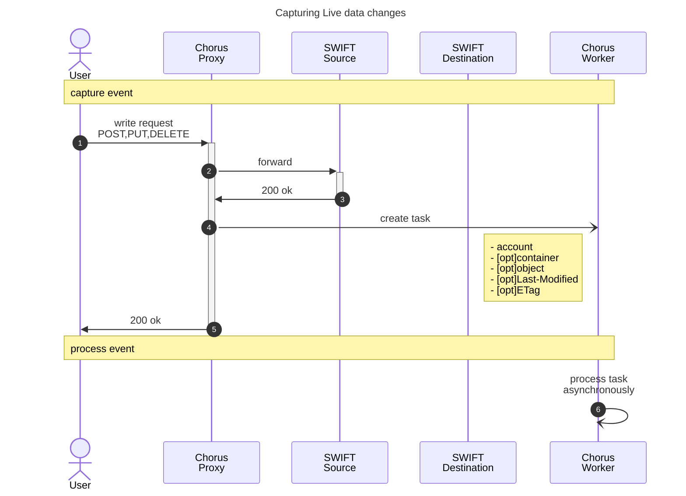
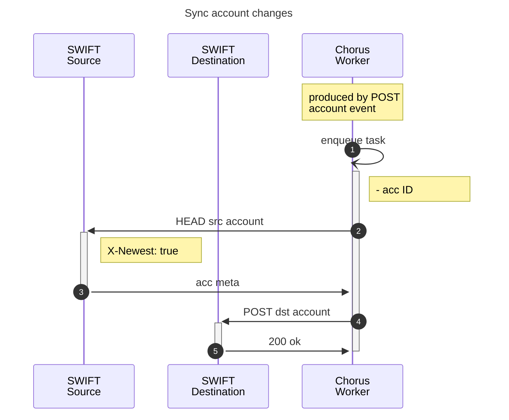
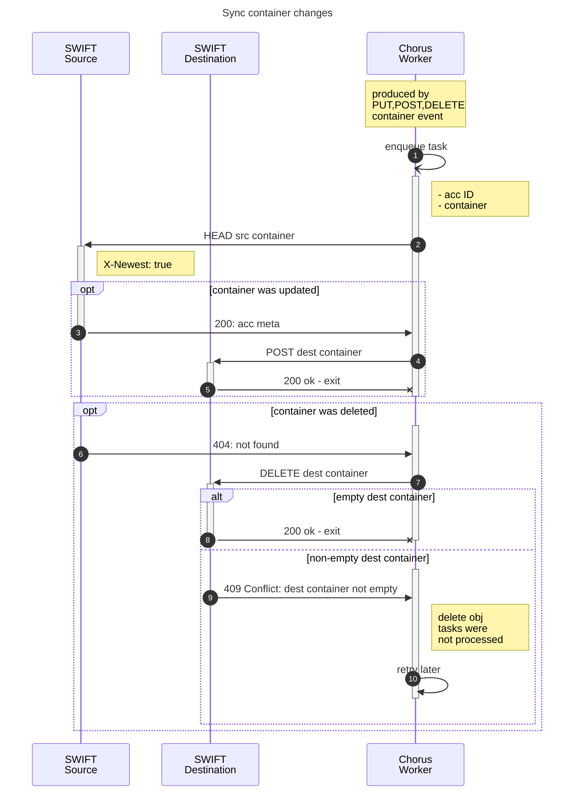
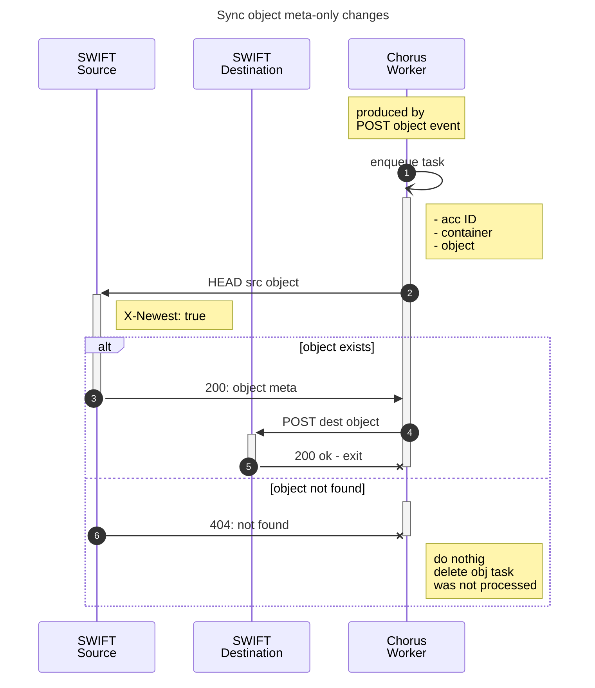
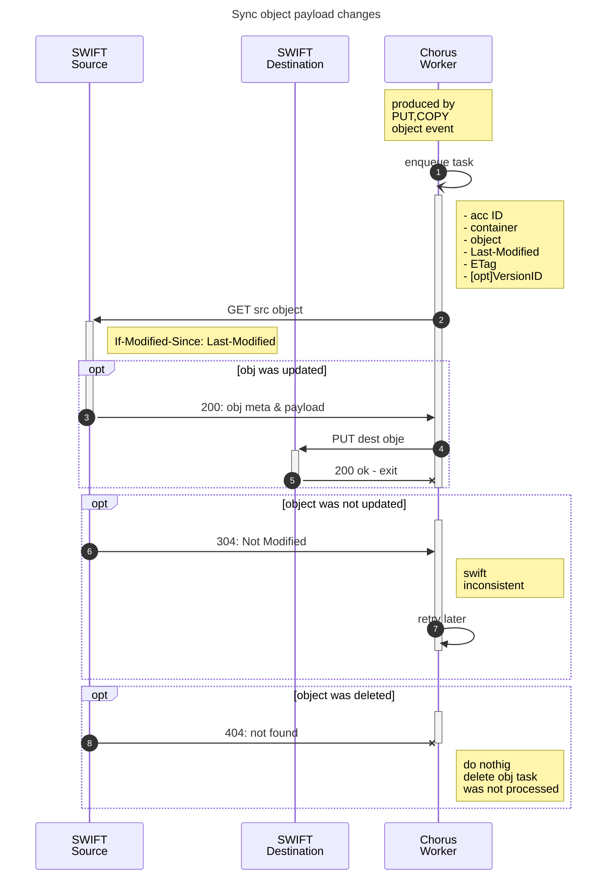
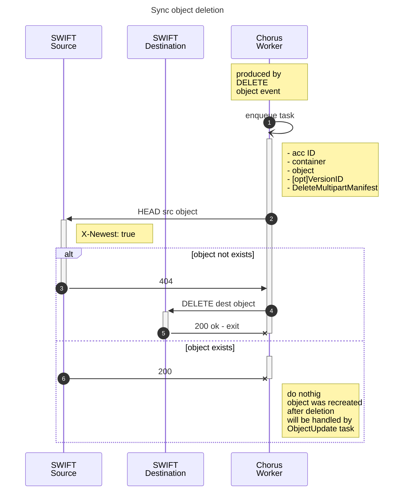

# Swift migration

Similar to S3 migration, SWIFT migration consists of two stages:
1. **Initial migration**: List all existing containers and objects in the source, then copy them to the destination in the background.
2. **Live migration**: Capture all data changes during the initial migration and apply them to the destination.

For a detailed overview of the S3 migration process, see the [article](https://docs.clyso.com/blog/s3-migration-with-chorus/) and the [step-by-step guide](https://docs.clyso.com/docs/products/chorus/usage/#s3-migration).

## 1. Initial migration

Workflow per account:
1. copy src account metadata to dest
2. list all containers in src account
3. create containers in dest and copy container metadata
4. list all objects in src containers
5. copy all objects with meta to dest
6. **TODO: how to resolve cross-container/cross-account dependencies - SLO,DLO,symlinks???**

## 2. Live migration

Chorus Proxy will capture all data changes made to the source SWIFT storage during the initial migration and produce the following tasks for Chorus workers:

### Account
Handles **ONLY** account metadata updates.
Account creation is handled by the initial migration. Account deletion is ignored because it can be done only by admin.

| Method | Description |
|--------|-------------|
| [POST](https://docs.openstack.org/api-ref/object-store/?expanded=#create-update-or-delete-account-metadata) | create, update, or delete account metadata |
| [DELETE](https://docs.openstack.org/api-ref/object-store/?expanded=#delete-the-specified-account) | IGNORED - admin only |

- Q: Is it OK to use Swift `X-Newest: true` header?
- Q: Is it possible that dest acc not exists?

### Container
Handles container, Creation, Metadata update, and deletion:

| Method | Description |
|--------|-------------|
| [PUT](https://docs.openstack.org/api-ref/object-store/?expanded=#create-container) | creates container |
| [POST](https://docs.openstack.org/api-ref/object-store/?expanded=#create-update-or-delete-container-metadata) | CRUD container metadata |
| [DELETE](https://docs.openstack.org/api-ref/object-store/?expanded=#delete-container) | deletes container |

- Q: It is possible that the source container is deleted, but the destination container is not empty and cannot be deleted. This can happen if the delete object task is processed after the delete container task (out of order). What should we do?
  - a) Retry the delete container task later (simple, but may cause a deadlock if the delete object task is lost due to a bug or outage).
  - b) Delete all objects in the container and try to delete the container again (may take a long time if there are many objects).
  - c) Create an async task to delete all objects, then retry the delete container task later.
  - d) Use [swift bulk delete](https://docs.openstack.org/swift/latest/api/bulk-delete.html). Is it supported by all swift implementations?
- Q: Should we support [container synchronization](https://docs.openstack.org/swift/latest/overview_container_sync.html)? What if container `X-Container-Sync-To` was not migrated to the destination? Should we exclude sync destination container from migration because it will by synced by swift anyway?

### Object

Unlike accounts and containers, Chorus creates a separate task for each Swift object operation and handles them individually. Each Swift object sync task is shown in a separate diagram below.

| Method | Description | Task Type |
|--------|-------------|------|
| [POST](https://docs.openstack.org/api-ref/object-store/?expanded=#create-or-update-object-metadata) | create or update object metadata | [`ObjectMetaUpdate`](#object-meta-update) |
| [PUT](https://docs.openstack.org/api-ref/object-store/?expanded=#create-or-update-object) | create or update object payload | [`ObjectUpdate`](#object-payload-update) |
| [COPY](https://docs.openstack.org/api-ref/object-store/?expanded=#copy-object) | copy object | [`ObjectUpdate`](#object-payload-update) same as for `PUT` |
| [DELETE](https://docs.openstack.org/api-ref/object-store/?expanded=#delete-object) | delete object | [`ObjectDelete`](#object-delete) |

- Q: In S3, objects are independent. In SWIFT, objects can be linked via SLO, DLO, or symlinks. How should this be handled?
   - a) Use a K8s controller-style approach: retry all tasks until all objects are synced. Consider mechanisms to detect and resolve deadlocks.
   - b) Indicate object dependencies in tasks and control task execution order in the queue—this is likely impossible.

#### Object meta update

- Q: if object was not found in src, but exists in dest, should we delete it?

#### Object payload update

Object payload update task is produced by `PUT` or `COPY` object event. 
The Chorus worker does not distinguish between `PUT` and `COPY`, because for `COPY`, the destination storage might not have the latest object update.
Therefore, both operations are handled by the same task type.

open questions: 
- slo dlo `multipart-manifest`. See: https://docs.openstack.org/swift/latest/overview_large_objects.html how to sync manifest if parts not yet synced? Retry?
- X-Delete-At
- symlinks
- Q: how to handle versioning?

#### Object delete

From [swift slo & dlo docs](https://docs.openstack.org/swift/latest/overview_large_objects.html):

> A DELETE request will just delete the manifest object itself. The segment data referenced by the manifest will remain unchanged.
>
> A DELETE with a query parameter:
>
> ?multipart-manifest=delete
> will delete all the segments referenced in the manifest and then the manifest itself. The failure response will be similar to the bulk delete middleware.
>
> A DELETE with the query parameters:
>
> ?multipart-manifest=delete&async=yes
> will schedule all the segments referenced in the manifest to be deleted asynchronously and then delete the manifest itself. Note that segments will continue to appear in listings and be counted for quotas until they are cleaned up by the object-expirer. This option is only available when all segments are in the same container and none of them are nested SLOs.

