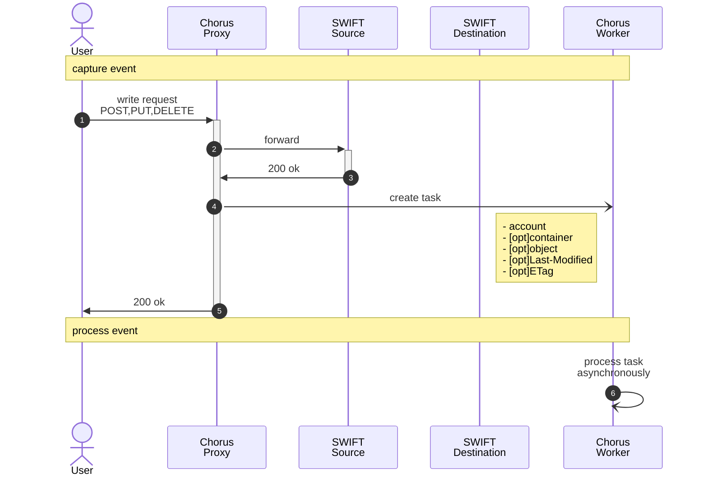
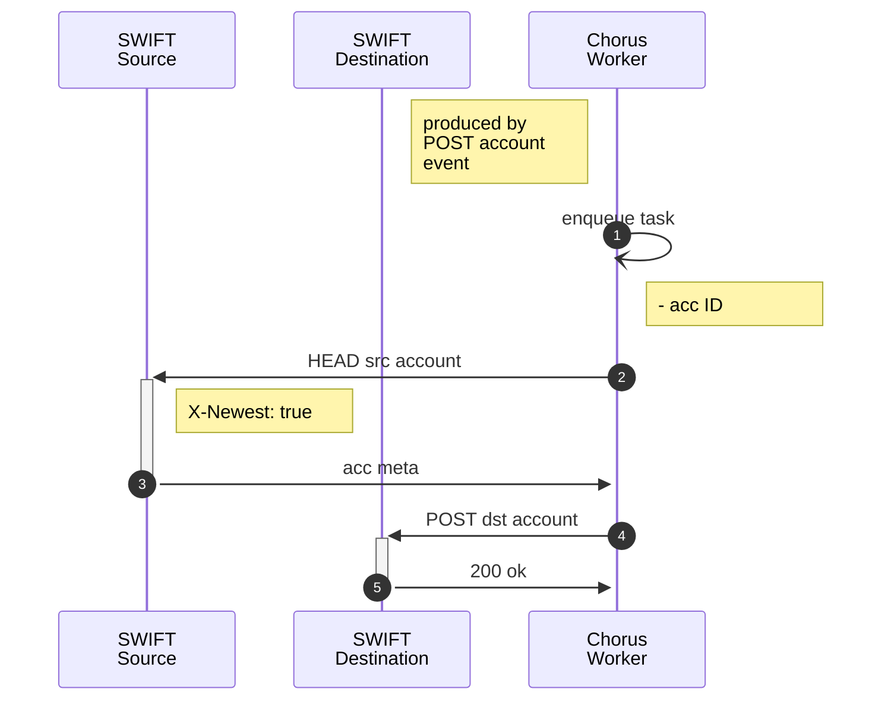
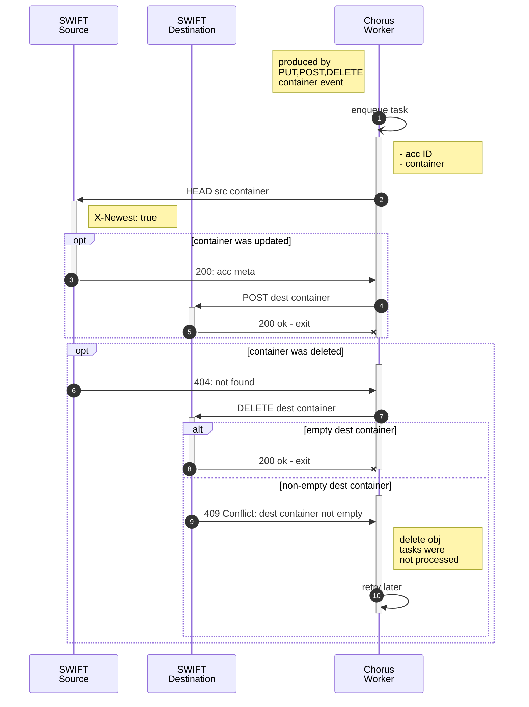
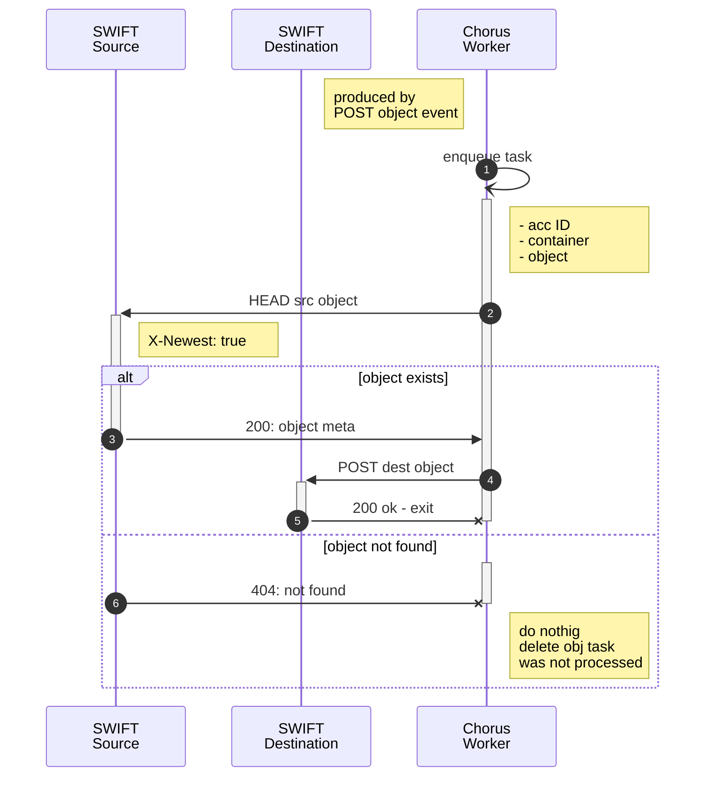
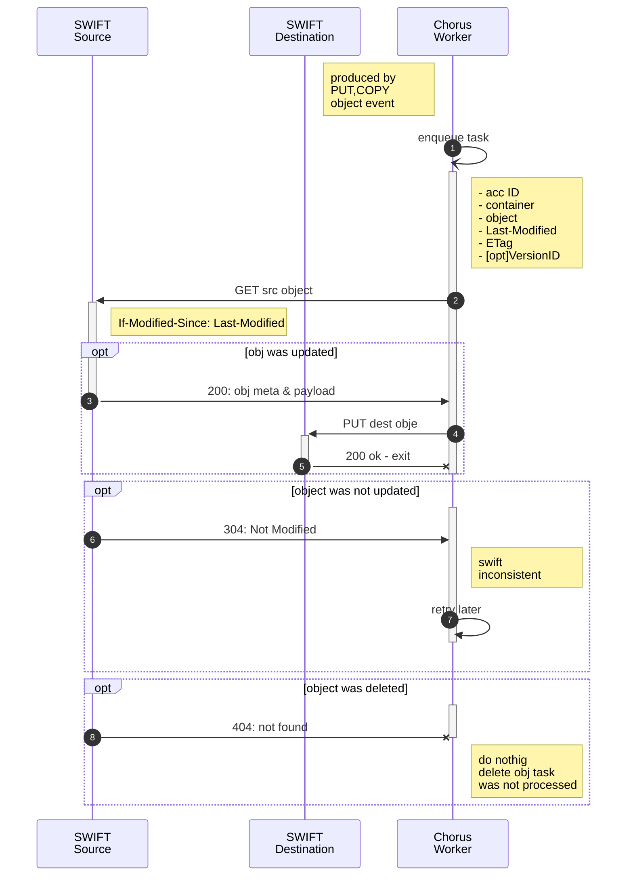

# Swift migration

Similar to S3 migration, SWIFT migration consists of two stages:
1. **Initial migration**: listing all containers and objects and copying them to the destination in the background.
2. **Live migration**: capturing all data changes happening during the initial migration and applying them to the destination.

## Initial migration

TODO

## Live migration
Chorus will capture all data changes done to the source SWIFT storage during the initial migration on chorus Proxy and produce the following tasks for Chorus workers:

```mermaid
 %%{init: { 'sequence': {'noteAlign':'left'} } }%%
sequenceDiagram
    autonumber
    Actor u as User
    Participant p as Chorus<br>Proxy
    Participant s as SWIFT<br>Source
    Participant d as SWIFT<br>Destination
    Participant w as Chorus<br>Worker

    note over u,w: capture event
    u->>+p: write request<br>POST,PUT,DELETE
    p->>+s: forward
    s->>-p: 200 ok
    p-)w: create task
    Note left of w: - account<br>- [opt]container<br>- [opt]object<br>- [opt]Last-Modified<br>- [opt]ETag
    p->>-u: 200 ok

    note over u,w: process event
    w-)w: process task<br>asynchronously<br>...
```

### Update Account
Handles **ONLY** account metadata updates. Account creation is handled by the initial migration. Account deletion is ignored because it can be done only by admin.

```mermaid
 %%{init: { 'sequence': {'noteAlign':'left'} } }%%
sequenceDiagram
    autonumber
    Participant s as SWIFT<br>Source
    Participant d as SWIFT<br>Destination
    Participant w as Chorus<br>Worker

    note left of w: produced by<br>POST account<br>event
    w-)+w: enqueue task
    Note right of w: - acc ID
    w->>+s: HEAD src account
    note right of s: X-Newest: true
    s->>-w: acc meta
    w->>+d: POST dst account
    d->>-w: 200 ok
```

### Update Container
Handles container, Creation, Metadata update, and deletion. 

```mermaid
 %%{init: { 'sequence': {'noteAlign':'left'} } }%%
sequenceDiagram
    autonumber
    Participant s as SWIFT<br>Source
    Participant d as SWIFT<br>Destination
    Participant w as Chorus<br>Worker

    note left of w: produced by<br>PUT,POST,DELETE<br>container event
    w-)w: enqueue task
    activate w
    Note right of w: - acc ID<br>- container
    w->>+s: HEAD src container
    note right of s: X-Newest: true

    opt container was updated
      s->>-w: 200: acc meta
      w->>+d: POST dest container
      d-x-w: 200 ok - exit
    end
    deactivate w

    opt container was deleted
      activate w
      s->>w: 404: not found
      w->>+d: DELETE dest container
      alt empty dest container
        d-x-w: 200 ok - exit
        deactivate w
      else non-empty dest container
        activate w
        d->>w: 409 Conflict: dest container not empty
        note right of w: delete obj<br>tasks were<br>not processed
        w->>w: retry later
        deactivate w
      end
    end
```

### Update Obj metadata

```mermaid
 %%{init: { 'sequence': {'noteAlign':'left'} } }%%
sequenceDiagram
    autonumber
    Participant s as SWIFT<br>Source
    Participant d as SWIFT<br>Destination
    Participant w as Chorus<br>Worker

    note left of w: produced by<br>POST object event
    w-)w: enqueue task
    activate w
    Note right of w: - acc ID<br>- container<br>- object
    w->>+s: HEAD src object
    note right of s: X-Newest: true

    alt object exists
      s->>-w: 200: object meta
      w->>+d: POST dest object
      d-x-w: 200 ok - exit
      deactivate w
    else object not found
      activate w
      s-xw: 404: not found
      deactivate w
      note right of w: do nothig<br>delete obj task<br>was not processed
    end
```
### Update Obj payload

open questions: 
- slo dlo
- X-Delete-At
- symlinks
- versioning????

```mermaid
 %%{init: { 'sequence': {'noteAlign':'left'} } }%%
sequenceDiagram
    autonumber
    Participant s as SWIFT<br>Source
    Participant d as SWIFT<br>Destination
    Participant w as Chorus<br>Worker

    note left of w: produced by<br>PUT,COPY<br>object event
    w-)w: enqueue task
    activate w
    Note right of w: - acc ID<br>- container<br>- object<br>- Last-Modified<br>- ETag<br>- [opt]VersionID
    w->>+s: GET src object
    note right of s: If-Modified-Since: Last-Modified

    opt obj was updated
      s->>-w: 200: obj meta & payload
      w->>+d: PUT dest obje
      d-x-w: 200 ok - exit
    end
    deactivate w

    opt object was not updated
      activate w
      s->>w: 304: Not Modified
      note right of w: swift<br>inconsistent
      w->>w: retry later
      deactivate w
    end
    opt object was deleted
      activate w
      s-xw: 404: not found
      deactivate w
      note right of w: do nothig<br>delete obj task<br>was not processed
    end
```
### Delete Obj

