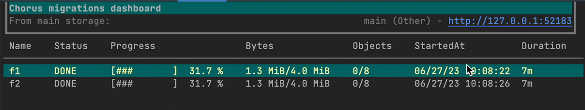

# Chorctl

CLI for Chorus management API.



## Install

From source (requires [Go language](https://go.dev/doc/install)):
```shell
cd ./tools/chorctl && go build .
```

Or install globally:
```shell
cd ./tools/chorctl && go install .
```

Or download binary from [the latest release](https://github.com/clyso/chorus/releases).

Or with homebrew (macOS and Linux only):
```shell
brew install clyso/tap/chorctl
```

## Usage

`chorctl` sends requests to the gRPC API hosted by [Chorus worker](../../service/worker).
Deploy worker and provide gRPC API address to `chorctl` with `--address` flag or `CHORUS_ADDRESS` envar:
```shell
export CHORUS_ADDRESS=127.0.0.1:9670
```

Run `chorctl --help` for available commands. Key commands:

### Dashboard
```shell
chorctl dash
```

### Replications
```shell
# List replications
chorctl repl

# User-level replication (all buckets for user)
chorctl repl add -u <user> -f <from storage> -t <to storage>

# Bucket-level replication
chorctl repl add -u <user> -b <bucket> -f <from storage> -t <to storage>

# See all repl subcommands
chorctl repl --help
```

### Switch (change main storage after replication)
```shell
chorctl repl switch --help
```

### Routing
```shell
chorctl route --help
```

### Consistency Check
```shell
chorctl consistency --help
```

### Dynamic Credentials
```shell
chorctl set-user --help
```

For full command reference, run `chorctl <command> --help`.
